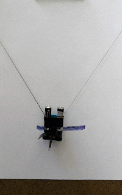
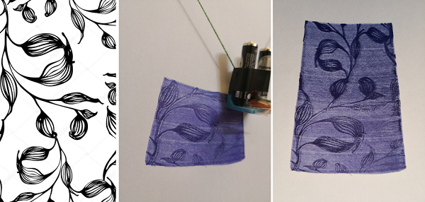

# Arduino-Plotter

## Hardware
- Arduino Uno (or any other one)
- Mini servo motor (e.g., MG90S Metal Gear Mini Servo)
- 2 small stepper motors (e.g., 5V 24BYJ48 stepper motor)
- SD card reader
- A board as plotter body

## Software
- Arduino IDE
- Script in any language to treshold image and save pixels in a ```txt``` file as image binary numbers




## Results



